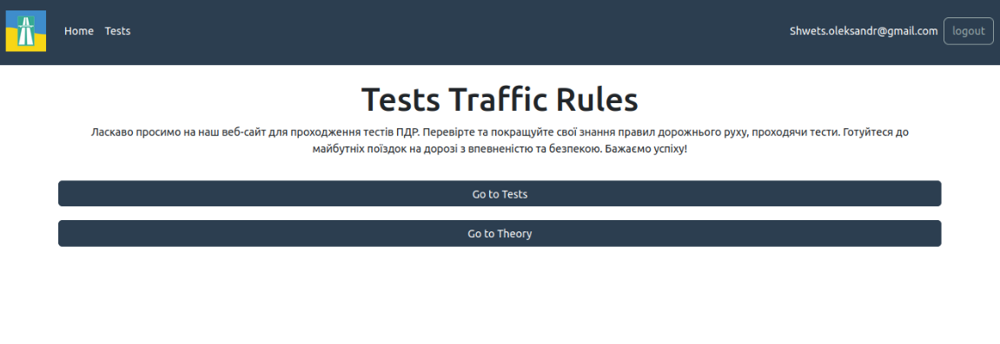
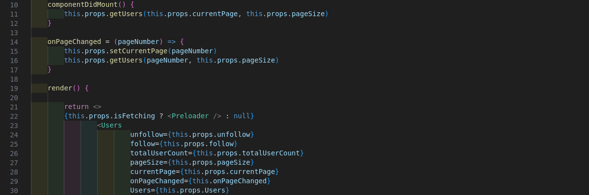
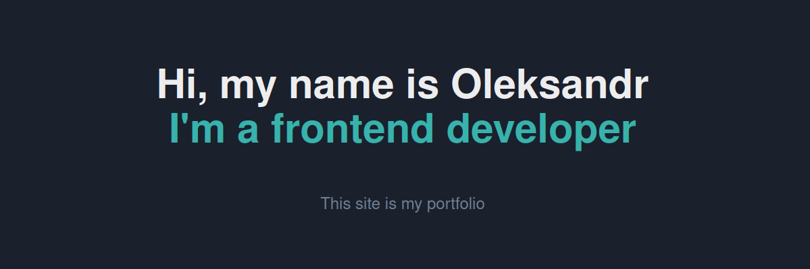

## Tests Traffic Rules
Web application for testing knowledge of traffic rules. It implements authorization, registration, output of single questions and tickets. This project was developed in a team, where I developed the entire client part of the site.
- 
- Tags: Tests Traffic Rules
- Badges:
  -  [blue]
- Buttons:
  - Link [https://github.com/Username-Loading/App-frontend.git]

## Social network
The social network is my first project and I developed it myself. The site is built on the basis of Reakt and Redux. The project currently needs revisions and the creation of a server part.
- 
- Tags: Social network
- Badges:
  -  [blue]
- Buttons:
  - Link [https://github.com/Username-Loading/Social.git]

## My website
Website which is my portfolio. It describes my projects, the technologies I use in development, as well as information about me.
- 
- Tags: My website
- Badges:
  -  [blue]
- Buttons:
  - Link [https://github.com/Username-Loading]
